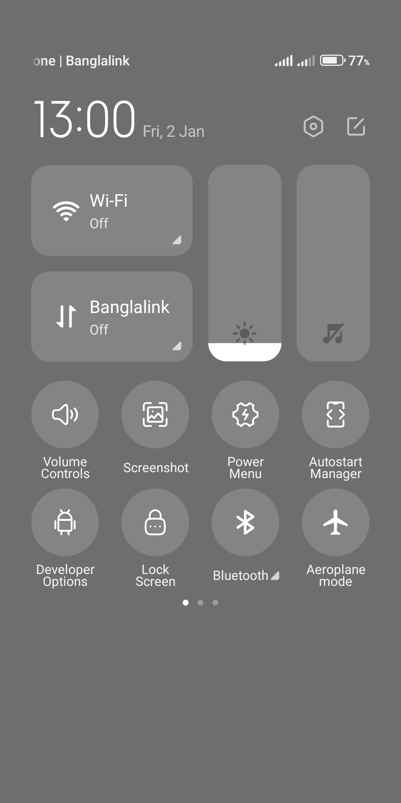
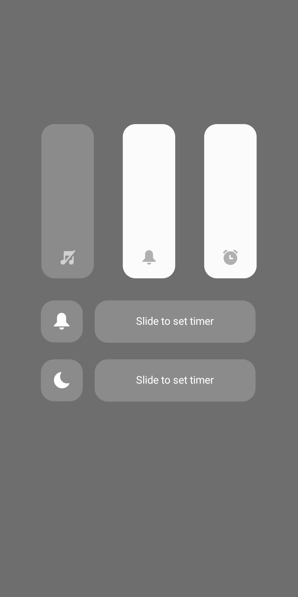
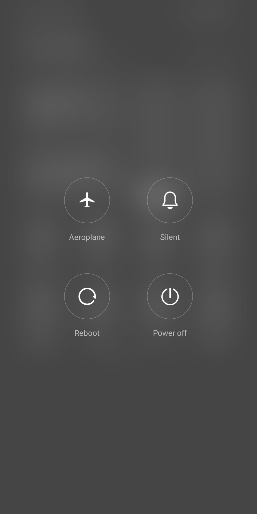

<div align="center">


<br />

# Quick Settings

A powerful Android Quick Settings app that provides convenient one-tile access to essential system functions.

[](https://android.com)
[](LICENSE)
[](https://android-arsenal.com/api?level=24)

[](https://github.com/codehasan/QuickSettings/releases/latest)

</div>

## ✨ Features

Quick Settings brings essential system controls right to your notification shade with beautiful, modern tiles:

###  Volume Control

- Quick access to volume controls
- Support for multiple audio streams

###  Developer Options
- Instant access to developer settings

###  Lock Screen *(Android 9.0+)*
- Put device to sleep

###  Screenshot *(Android 9.0+)*
- Instant screenshot capture

###  Power Menu
- Quick access to power options
- Restart, shutdown, and reboot controls

###  Bluetooth
- Quick access to Bluetooth settings
- Toggle Bluetooth connectivity

###  Autostart Manager
- Manage app autostart permission in Chinese roms

## 📱 Screenshots

<div align="center">





</div>

## 🛠️ Technical Details

### Architecture
- **Tile Services**: Each feature is implemented as a separate `TileService`
- **Accessibility Service**: Global action handling for system-level operations
- **Direct Boot Aware**: Works on encrypted devices

### Permissions
The app requires minimal permissions:
- `BIND_QUICK_SETTINGS_TILE` - For registering quick settings tiles
- `BIND_ACCESSIBILITY_SERVICE` - For global system actions (optional)

### Compatibility
- **Minimum Android Version**: Android 7.0 (API 24)
- **Target Android Version**: Latest Android SDK
- **Some features require Android 9.0+** for enhanced functionality

## 📱 Installation

1. Download the latest APK from the [Releases](https://github.com/codehasan/QuickSettings/releases/latest) page
2. Enable installation from unknown sources in your device settings
3. Install the APK

## 🔧 Setup

After installation:

1. **Enable Accessibility Service** (for advanced features):
   - Go to Settings → Accessibility → Quick Settings
   - Enable the service

2. **Add Tiles**:
   - Edit your Quick Settings panel
   - Select the tiles you want to use
   - Arrange them in your preferred order

## 🤝 Contributing

Contributions are welcome! Please feel free to submit a Pull Request. For major changes, please open an issue first to discuss what you would like to change.

### Development Setup
```bash
git clone https://github.com/codehasan/QuickSettings.git
cd QuickSettings
# Open in Android Studio
# Build and run
```

## 📄 License

This project is licensed under the MIT License - see the [LICENSE](LICENSE) file for details.

## 🙏 Acknowledgements

We would like to thank the following resource providers for making this project possible:

- **Icons** - [Huge Icons](https://hugeicons.com/) for providing beautiful and modern icon sets.
- **Future Graphic** - [Hotpot AI](https://hotpot.ai/) for AI-generated graphics and design elements.
- **Logo** - [SVG Repo](https://www.svgrepo.com/) for high-quality SVG logos and icons.

---

<div align="center">

**Made with ❤️ for Android users**

[GitHub](https://github.com/codehasan/QuickSettings) • [Issues](https://github.com/codehasan/QuickSettings/issues) • [Releases](https://github.com/codehasan/QuickSettings/releases)

</div>
